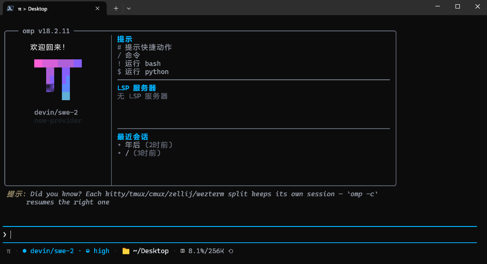
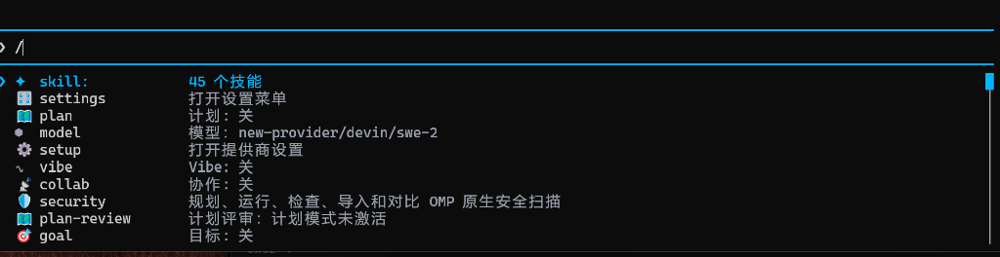
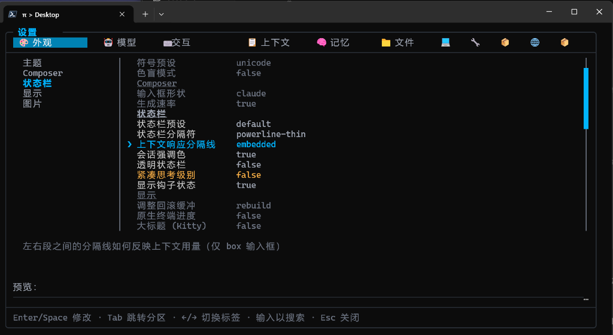

# omp-di18n

**[简体中文](README.md) | English**

**Runtime Simplified Chinese localization for [oh-my-pi](https://github.com/can1357/oh-my-pi) (omp) — no fork, no rebuild, works on the official binary.**

omp-di18n patches the TUI components through omp's extension API at runtime, translating settings panels, menus, the status bar, slash-command descriptions, the welcome screen and more into Chinese. Model-facing prompts and tool descriptions stay in English, so agent behavior is unaffected.

## Screenshots

| Welcome screen | Slash commands | Settings panel |
|---|---|---|
|  |  |  |

## Install

### Option 1: Marketplace (recommended)

Inside an omp session:

```
/marketplace add losewayy/omp-di18n
/marketplace install omp-di18n@omp-di18n
```

### Option 2: Git install

```
omp plugin install github:losewayy/omp-di18n
```

### Option 3: Manual

Copy `omp-di18n/omp-di18n.ts` and `omp-di18n/omp-di18n.zh-CN.json` into `~/.omp/agent/extensions/` and restart omp.

Restart omp after installing. Uninstall with `omp plugin uninstall omp-di18n`, or just delete the files for a manual install.

## What it covers

- All settings tabs (option names + descriptions)
- Slash-command menu descriptions
- Welcome screen (greeting, tips, recent sessions, LSP status)
- Status bar and footer key hints
- Pickers and dialogs (model, session, theme, rewind — 60+ components)
- Notifications and dynamic text (e.g. `45 skills` → `45 个技能`)

The dictionary ships ~1,700 entries, reviewed entry-by-entry with unified terminology. Any untranslated UI string is logged to `omp-di18n.misses.txt` next to the extension — feel free to open an issue with that file attached.

## In-session commands

| Command | Effect |
|---|---|
| `/di18n` | Show status (dictionary size, translated/missed counts) |
| `/di18n off` / `/di18n on` | Toggle localization |
| `/di18n reload` | Hot-reload after editing the dictionary |
| `/di18n misses` | Show where untranslated strings are collected |

## Compatibility

- Tracks official omp releases — `omp update` needs no action from you
- New upstream UI strings simply stay in English and land in the misses log
- Every patch point fails independently — one broken patch never takes down the rest
- Verified on omp v18.2.x (Windows; macOS/Linux should behave identically — feedback welcome)

## How it works

On startup the extension patches the render entry points of UI components exported by `pi-tui`/`pi-coding-agent`, then resolves each string against `omp-di18n.zh-CN.json` in order: exact match → `${...}` template match → ANSI-aware segmented match → dynamic rules. Translations preserve terminal display width so box borders stay aligned. Content-type components (messages, code, diffs) only get exact-match translation, so model output is never mangled.

## License

MIT. Parts of the zh-CN dictionary are derived from [oh-my-pi-zh](https://github.com/LiuQingHuaYang/oh-my-pi-zh) (MIT) — see [THIRD_PARTY_NOTICES.txt](THIRD_PARTY_NOTICES.txt).
